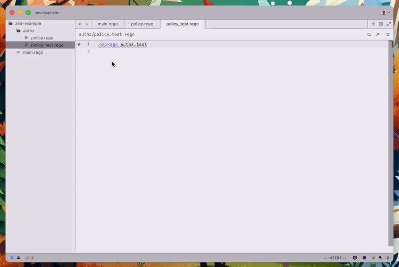

# Zed Rego Extension

[](https://github.com/styrainc/zed-rego/actions)

Zed extension for the Rego policy language from [Open Policy Agent](https://github.com/open-policy-agent/opa/) (OPA).



See the blog
[introducing the zed-rego extension](https://www.styra.com/blog/introducing-the-rego-extension-for-the-zed-editor/)
if you want to learn more about the background and motivation for this extension, as well as a detailed overview of its
features.

## Features

### Rego Syntax Support

Basic features like syntax highlighting and indentation works out of the box. More advanced features are provided
by [Regal](https://github.com/styrainc/regal).

### Regal Language Server Support

This extension uses the Regal language server for Rego to provide most of its
functionality. The following features of the language server are currently supported:

- [x] Diagnostics (linting)
- [x] Hover (inline docs on built-in functions)
- [x] Go to definition (cmd + click on a reference to go to definition)
- [x] Folding ranges (expand/collapse blocks, imports, comments)
- [x] Document and workspace symbols (cmd+t to navigate to rules, functions, packages)
- [x] Inlay hints (but may need to be enabled in settings "Toggle inlay hints")
- [x] Formatting
- [x] Code actions
- [x] Code completion
- [ ] Code lenses (click to evaluate package or rule) - not yet supported by Zed

To learn more about each language server feature provided, see the
Regal [language server](https://docs.styra.com/regal/language-server) documentation.

## Installation

This extension is available in the Zed extension marketplace, and you'll find it by searching for "rego" in the
extensions view.

Since the extension makes use of [Regal](https://github.com/styrainc/regal) for language server features, the extension
will automatically try to download the latest version of Regal to use, unless the `regal` binary is found on `$PATH`.

If you want to have updates of Regal managed automatically, you can use Homebrew to install the `regal` binary instead
(MacOS & Linux):

```shell
brew install styrainc/packages/regal
```

## Tasks

This extension additionally provides two [tasks](https://zed.dev/docs/tasks) for running tests. Note that both of the
tasks assume that the workspace can be read as a bundle (similarly to what the
[OPA extension for VS Code](https://marketplace.visualstudio.com/items?itemName=tsandall.opa) expects).

### opa test (workspace)

Runs all tests found in the workspace. This is a normal task made available in the command palette (`task: spawn`).

### opa test (single test)

This is a special task (called a _runnable_) which is made available inside of test packages, and
where a "play" button will appear next to any test rule. Pressing this button will run only that test.

### opa eval ?

The `opa eval` command requires a query containing the full path to what should be evaluated. This is commonly the
package path + the name of the rule to be evaluated. While we can use a tree-sitter query to extract the rule name —
like we do for running single tests — we have yet to understand if it's possible / how to extract both the package
path and the rule name and concatenate them to build a query.

You can however easily create a [custom task](#custom-tasks) for `opa eval` where you provide the query yourself, and
use that in your project. Such a task may look something like the example below:

**.zed/tasks.json**
```json
[
  {
    "label": "opa eval (data.policy.main)",
    "command": "opa",
    "args": ["eval", "--bundle", "$ZED_WORKTREE_ROOT", "--input", "$ZED_WORKTREE_ROOT/input.json", "data.policy.main"],
  }
]
```

## Custom Tasks

See the Zed documentation [tasks](https://zed.dev/docs/tasks) for information about how to easily add your own custom
tasks, either globally or to a specific project. These docs also details which environment variables are available in
the task execution context.

## Development

See the docs on [contributing](docs/CONTRIBUTING.md) if you're interested in hacking on this extension.

## Credits

- Tree-sitter grammar provided by the [tree-sitter-rego](https://github.com/FallenAngel97/tree-sitter-rego) project
- Language server for Rego provided by [Regal](https://github.com/StyraInc/regal)

## Community

For questions, discussions and announcements related to Styra products, services and open source projects, please join
the Styra community on [Slack](https://inviter.co/styra)!
